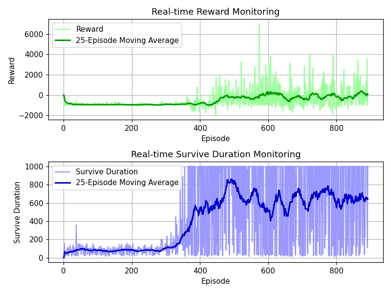
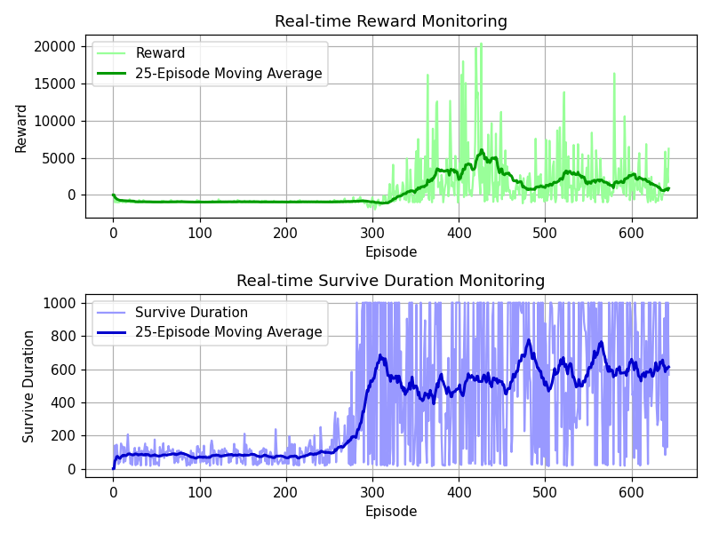

# Special models
These models shouldn't be deleted.


### PPO_20240111-130126
Training time: 2:43
Iterations: 17m
Special notes: Reward for distance removed, added penalty for not reaching target in time.

```python
# Penalty for not reaching a target
reward -= min((self.episodes_without_target - 100) * 0.001, 3)
```



Config.yaml:
```yaml
drone:
  mass: [0.1, 0.2, 0.3]     # Min, Default, Max 
  inertia: [0.1, 0.2, 0.3]  # Min, Default, Max 
  gravity: [0.9, 1, 1.1]    # Min, Default, Max 
  motors:
    - [-0.5, 0, 0, 30]
    - [0, 0, 0, 30]
    - [0.5, 0, 0, 30]    # X offset from drone center, Y offset from drone center, rotation relative to drone center, thrust

environment:
  num_targets: 3 # Number of targets to spawn
  domain_randomization: True
```


### PPO_20240111-163915
Training time: 2:43
Iterations: 17m
Special notes: Same as above but without domain randomization


